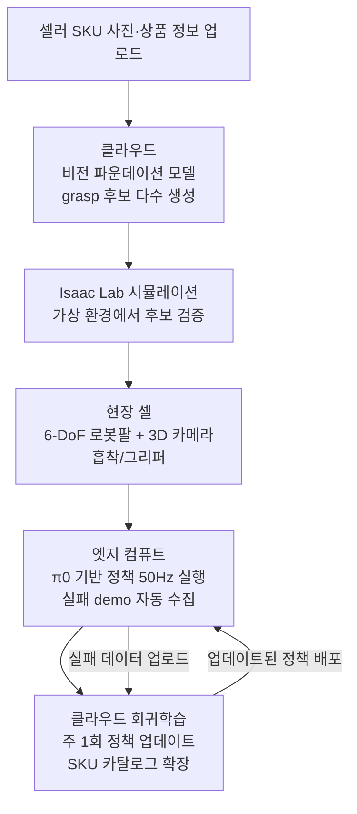

# 제안서: 중소 3PL용 이형 SKU 제로샷 피킹 RaaS (Idea B 구체화)

> **이 문서가 누구를 위한 것인지** — [IDEAS.md §5.1](IDEAS.md#L468) Top 2 추천 후보 1건(후보 B, [§3.2](IDEAS.md#L131))의 단독 제안서.
> AI·로봇 비전공 학부생도 따라올 수 있도록 핵심 기술 용어가 처음 등장하는 자리 직전에 "쉽게 말하면" 박스를 둔다. 박스는 요약일 뿐이며, **정확한 수치·모델명은 본문에 그대로 보존**되고 모든 인용은 [RESEARCH.md](RESEARCH.md) 라인 번호로 추적 가능하다.
> 자매 제안서: [PROPOSAL-D.md](PROPOSAL-D.md) (시설 농가용 부드러운-과실 파지 VLA 파인튜닝 서비스).

---

## 0. 한 줄 피치

> **쉽게 말하면**
> 창고에서 물건을 집어 올리는 로봇은 네모난 박스는 잘 집지만, **찌그러진 봉지·꽃다발·화장품 샘플같이 모양이 제각각인 물건**에서는 자주 실패한다. 우리는 그런 이형(異形) 상품도 **사전 등록 없이 처음 본 순간 바로** 집어내는 로봇을 만들고, **로봇을 사는 대신 월 구독으로 빌려 쓰는** 방식으로 중소 물류업체에 공급한다.

99.5%↑ 평균 정확도를 가진 대형 자동화 시스템도 **이형·변형·깨지기 쉬운 SKU에서 급락**하는 현실([RESEARCH.md A-2 §1](RESEARCH.md#L304))을, **비전 파운데이션 모델 + Diffusion Policy 기반 제로샷 파지**로 극복하는 **중소 3PL 구독형(RaaS)** 서비스.

> §4-bis 8축 재매트릭스에서 본 후보는 **F1(시스템 구성 도식화)·F2(사용자·비즈니스 정량)**에서 동시 만점을 받아 총 37점으로 2위에 올랐다([IDEAS.md §4-bis](IDEAS.md#L437)).

---

## 1. 문제 (Why now)

현장의 세 가지 페인포인트를 리서치 수치로 고정한다.

### 1.1 대형 자동화도 "이형 SKU"에서 무너진다

> **쉽게 말하면**
> "SKU"는 상품 종류를 구별하는 상품코드, "이형(異形) SKU"는 **모양이 표준이 아닌 상품**을 말한다(찌그러진 봉지·꽃다발·연포장 식품·화장품 트레이). 박스는 모서리가 각져 그리퍼로 잡기 쉽지만, 이런 물건은 **잡는 자세가 매번 다르다**.

- 전체 피킹 정확도 **99.5%+를 달성하는 시스템도, 이형·변형·손상 SKU에서는 성공률이 급락**한다(TGW 2025, [RESEARCH.md A-2 §1](RESEARCH.md#L304)).

### 1.2 성수기 인력난이 구조적이다

> **쉽게 말하면**
> MHI는 미국 물류 업계 협회로 매년 업계 설문을 낸다. 응답자의 **절반 가까이**가 "사람 구하기가 **매우** 어렵다"고 답했다는 건, 간헐적 어려움이 아니라 **이미 구조적 문제**라는 뜻이다.

- **MHI 2025 보고서: 45~52% 기업이 "노동 확보 매우 어렵다"**고 답변([RESEARCH.md A-2 §2](RESEARCH.md#L305)).
- 한국 3PL 현장도 동일 — 블랙프라이데이·명절 성수기에 일용직 피커를 예약해도 채우지 못하는 사례가 반복된다.

### 1.3 한국 중소 3PL에는 선택지가 없다

> **쉽게 말하면**
> "3PL"은 **물류를 외주받아 대신 처리하는 업체**(Third-Party Logistics). 쿠팡·CJ 같은 대기업은 자체 로봇을 직접 만들어 쓰지만, 중소 3PL은 Amazon Sequoia처럼 셀 하나에 수억 원 드는 장비를 감당할 수 없다. "RaaS"는 **로봇을 사지 않고 월 구독으로 빌려 쓰는** 모델(Robot-as-a-Service)로 이 간극을 메운다.

- 쿠팡(THiRAbot)·CJ(5G 프라이빗망 + 휴머노이드 PoC)는 **인하우스 자체 구축**이 가능하지만, 중견·중소 3PL은 진입 비용이 장벽.
- **한국 중견·중소 3PL용 RaaS 모델 확산이 미흡**하다는 것이 A-2 영역의 명시적 기술적 공백([RESEARCH.md A-2 기술적 공백](RESEARCH.md#L326)).

---

## 2. 타겟 사용자 & 니즈

### 2.1 주 타겟 / 부 타겟

- **주 타겟**: 매출 **100억~1,000억 규모 한국 중소 3PL의 운영팀장**. Amazon Sequoia·Stretch 같은 대형 CAPEX를 감당 못 하지만, 인력난·이형 SKU 클레임은 대기업과 동일하다.
- **부 타겟**: **D2C 셀러**(이형 식품·화장품·패션 부자재 중심) — 가격은 동일 단위 카운트로 책정.

### 2.2 사용자 니즈

- **월 구독으로 1셀 도입** → 제로샷 파지 가능 SKU 카탈로그가 **자동으로 확장**되고, 실패 케이스가 **자동으로 회귀 학습**되는 폐루프.

### 2.3 가상 현장 페르소나 — "김정훈 운영팀장"

> 경기 광주에 위치한 매출 300억 규모 3PL 업체 운영팀장. D2C 화장품·식품 셀러 40여 곳의 출고를 대행한다. 11월 블랙프라이데이부터 12월 말까지는 **일용직 피커를 40명 모집해야 하지만 실제로는 25~30명밖에 확보하지 못해** 잔업비와 오배송 클레임이 동시에 폭발한다. Amazon Sequoia 급 전면 자동화는 CAPEX 상 불가능하고, 셀러마다 쏟아지는 신규 SKU를 **사전에 학습시킬 시간도 인력도 없다**. 그가 원하는 것은 "모레 입고되는 신규 립스틱 샘플 500종을 **오늘 등록 없이** 집어낼 수 있느냐"이다.

이 페르소나가 본 제안서의 모든 KPI·가격 모델·우선순위를 판정한다.

---

## 3. 핵심 AI 기술 ★

본 후보의 기술 선택 이유는 한 문장으로 요약된다 — **이형·변형 SKU에서 "정답 파지 자세 하나"를 고르는 게 아니라, "여러 후보를 동시에 떠올려 가장 안전한 걸 고르는" 구조가 본질적으로 더 잘 맞는다**. 이 절은 그 구조를 구성하는 블록을 차례로 설명한다.

### 3.1 사용 기술 한눈에

| 기술 | 한 줄 정체 | 왜 이 후보에 쓰이는가 |
|---|---|---|
| **비전 파운데이션 모델** | 인터넷 스케일 이미지로 사전학습된 "범용 시각 두뇌" | 처음 본 이형 SKU에서도 grasp 후보를 **제로샷**으로 뽑기 위해 |
| **Diffusion Policy** | 정답 동작 하나가 아니라 **여러 후보 동작을 동시에 떠올리는** 정책 학습 방식 | 이형 SKU의 파지 자세는 본질적으로 다중모드(여러 정답 공존) |
| **SE(3)-equivariant** | 물체가 **회전·이동해도 같은 방식으로** 집히게 만든 수학 구조 | 컨베이어 위 자세가 매번 달라도 학습 효율이 유지됨 |
| **π0 / π0.5 (openpi)** | Physical Intelligence가 만든 오픈 로봇용 파운데이션 모델 | 비전·언어·액션 사전학습이 이미 끝나 있어 바닥부터 학습 불필요 |
| **Open X-Embodiment** | 21개 기관이 공유한 **100만+ 로봇 시연 데이터셋** | 사전학습 기반. "내 로봇 데이터"만으로는 이형 일반화가 불가능 |
| **Isaac Lab** | NVIDIA의 로봇 시뮬레이터 | 실제 로봇에 내리기 전에 **가상 환경에서 수천 번** 검증 |
| **엣지 추론 + 클라우드 회귀** | AI를 **현장 PC**(엣지)에서 돌리고, 실패 데이터는 **클라우드**에서 재학습 | 50Hz 제어와 주 1회 정책 개선을 동시에 |

이하 각 기술을 "쉽게 말하면" → 원본 기술 설명 → RESEARCH 앵커 순으로 푼다.

### 3.2 선택 이유 — 왜 Diffusion Policy인가

> **쉽게 말하면 (다중모드란?)**
> 사람이 손에 쥔 립스틱을 집는 방법은 한 가지가 아니다 — 옆으로 집을 수도, 위에서 눌러 잡을 수도, 뚜껑 쪽을 잡을 수도 있다. **정답이 여러 개 공존하는 상황**을 "다중모드(multi-modal)"라 한다. 이전 방식(정답 하나를 회귀로 학습)은 **여러 정답의 평균**을 내서 엉뚱한 자세를 뱉기 쉽다. Diffusion Policy는 "여러 후보를 동시에 떠올린 뒤 하나를 고르는" 방식이라 이 문제에 강하다.

- 이형·변형 SKU의 파지 자세는 **Diffusion Policy의 자연 적합 영역**([RESEARCH.md Part 3 §3-6](RESEARCH.md#L730)). "범용 grasp 후보 생성 → 시뮬 검증 → 실로봇 미세조정" 폐루프가 이 구조 위에서 가능해진다.
- 2025년 **Spherical Diffusion Policy(SDP)가 ICML 2025**에서 **SE(3)-equivariant spherical Fourier** 구조로 발표되어([RESEARCH.md §3-6](RESEARCH.md#L735)), 파지 자세 학습에 회전·이동 불변성을 수학적으로 강제할 수 있게 되었다.

> **쉽게 말하면 (SE(3)-equivariant)**
> 립스틱이 90도 돌아 놓여 있어도 **로봇이 90도 회전한 파지 자세**를 그대로 뽑아내도록 모델 구조 자체에 회전·이동 규칙을 심어두는 기법. 데이터를 회전시켜 억지로 가르치지 않아도 저절로 일반화된다.

### 3.3 베이스 모델 — π0 / π0.5

> **쉽게 말하면 (파운데이션 모델)**
> "한 번 엄청나게 큰 데이터로 학습해두고, 여러 작업에 재사용하는 범용 두뇌"가 파운데이션 모델(Foundation Model)이다. 언어 모델의 GPT가 텍스트용 파운데이션 모델이라면, **π0는 로봇 동작용 파운데이션 모델**이다.
>
> "VLA(Vision-Language-Action)"는 **카메라 화면을 보고, 말로 받은 지시를 이해하고, 동작으로 옮기는 통합 AI**([RESEARCH.md Part 3 §3-1](RESEARCH.md#L674)). π0는 이 구조의 대표 모델 중 하나다.
>
> "파라미터"는 모델의 **학습 가능한 내부 수치의 개수** — AI의 뇌세포 수에 해당한다. "사전학습(pre-training)"은 **우리 작업 이전에 엄청나게 큰 일반 데이터로 미리 학습해둔 단계**, "파인튜닝(fine-tuning)"은 **이미 똑똑해진 모델에게 우리 작업 데이터만 조금 더 가르치는 단계**다.

- 베이스: **Physical Intelligence의 π0 / π0.5**([RESEARCH.md B-3](RESEARCH.md#L209)). 라이선스는 **openpi Apache 2.0**으로 상업 이용 가능.
- π0는 **VLM + flow matching 50Hz** 구조로 **7 플랫폼 68 태스크 SOTA**를 기록했고, π0.5는 **처음 보는 가정에서 10~15분 청소**를 수행한 계층적(서브태스크+액션) 정책이다([RESEARCH.md B-3 모델표](RESEARCH.md#L595)).
- **Open X-Embodiment**(21기관, **1M+ trajectory, 22 embodiments, 527 skills**)로 사전학습 가중치를 활용한다([RESEARCH.md B-4](RESEARCH.md#L630)).

> **쉽게 말하면 (trajectory / embodiment)**
> "trajectory"는 **로봇이 과제를 한 번 끝마치기까지의 모든 움직임 기록**(팔 각도·카메라 영상·성공 여부 등). "embodiment"는 **로봇의 몸체 종류**(팔이 한 개인지 두 개인지, 바퀴가 있는지 등). Open X-Embodiment는 **22가지 다른 몸체의 로봇**이 모은 **100만 개 이상의 과제 기록**을 모아놓은 데이터셋이다.

> **쉽게 말하면 (정책 / policy)**
> "정책(policy)"은 **어떤 상황에서 어떻게 움직일지 결정하는 규칙 묶음**. 자율주행의 "운전 매뉴얼"에 해당한다. 우리가 만드는 것은 "이형 SKU 파지 정책"이고, π0는 그 정책의 **출발점**이 되는 사전학습 가중치다.

---

## 4. 기존 서비스 대비 차별점

> **이 표를 어떻게 읽나** — 왼쪽 열은 지금 시장에 있는 경쟁 제품, 가운데 열은 그 제품이 **못 하는 것**, 오른쪽 열은 본 후보가 **바로 그 공백을 어떻게 메우는가**를 1문장으로 보여준다.

| 비교 대상 | 한계 | 본 후보의 차별 |
|---|---|---|
| **Boston Dynamics Stretch** | **700 case/hr**이지만 **케이스박스 위주, 이형 화물 취약**([RESEARCH.md A-2 표](RESEARCH.md#L315)) | 비-박스 이형 SKU(화장품 트레이·꽃다발·연포장 식품)가 1순위 |
| **Locus Robotics AMR** | 사람이 파지(어시스트만)([RESEARCH.md A-2 표](RESEARCH.md#L316)) | 파지 **자체**를 자동화 |
| **Amazon Sequoia / Proteus** | 인하우스 전용·품목 형상 제약 | 외부 3PL 대상 **RaaS 단가 모델** |
| **씨메스**(국내 3D 비전 + AI 피킹) | 유사 영역 강자 — 본 후보의 **가장 직접적 경쟁자** | **RaaS·구독형** + **이형 SKU 카탈로그 자동 확장**이 차별점 |

> **쉽게 말하면 (AMR)**
> "AMR(Autonomous Mobile Robot)"은 **바닥을 스스로 돌아다니는 자율이동로봇**. Locus Robotics AMR은 사람 피커 옆으로 달려가 상품을 실어 나르는 역할만 하고, **집는 행위는 사람이 한다** — 이게 차별 포인트다.

---

## 5. 시스템 구성 (어떻게 작동하는가)

### 5.1 흐름도



> Mermaid 렌더링 미지원 환경을 위해 원본 ASCII 플로우도 보존한다.
>
> ```
> [D2C/3PL 셀러 SKU 사진]
>         │
>         ▼
> [클라우드: 비전 FM grasp 후보 생성 + 시뮬 검증(Isaac Lab)]
>         │
>         ▼
> [현장 셀: 6-DoF 팔 + 3D 카메라 + 흡착/그리퍼]
>         │
>         ▼
> [엣지: π0 기반 정책 50Hz 실행 + 실패 demo 자동 수집]
>         │
>         ▼
> [클라우드 회귀학습 — 주 1회 정책 업데이트, 카탈로그 확장]
> ```

### 5.2 단계별 설명

1. **셀러 SKU 업로드** — 셀러가 신규 상품 사진을 업로드.
    - *쉽게 말하면*: 로봇에게 "이런 모양의 물건이 들어올 거야"라고 **사진으로 귀띔**하는 단계.
2. **클라우드: 비전 FM grasp 후보 생성** — 비전 파운데이션 모델이 해당 SKU에 대해 가능한 파지 자세 후보 N개를 뽑는다.
    - *쉽게 말하면*: "이 립스틱은 이렇게도, 저렇게도 집을 수 있다"를 **수십 가지 떠올리는** 단계.
3. **Isaac Lab 시뮬 검증** — NVIDIA Isaac Lab에서 후보마다 가상 실행, 성공률·안정성으로 필터링.
    - *쉽게 말하면*: 실제 로봇을 움직이기 전에 **컴퓨터 속 가상 공장에서** 미리 연습해 본다.
4. **현장 셀 실행** — 6-DoF 로봇팔 + 3D 카메라 + 흡착/그리퍼로 구성된 셀이 실제 파지 수행.
    - *쉽게 말하면*: "6-DoF"는 **6개 방향으로 자유롭게 움직이는** 관절 구조, "그리퍼"는 **로봇 팔 끝에 붙은 손/집게**.
5. **엣지 추론 + 실패 demo 수집** — 현장 PC에서 π0 정책을 50Hz로 돌리며, 실패 케이스를 자동 기록.
    - *쉽게 말하면*: "엣지 추론"은 **클라우드를 거치지 않고 현장 기기에서 바로** AI를 돌리는 것. 네트워크 지연을 없애 50Hz(초당 50회) 제어가 가능해진다.
6. **클라우드 회귀학습** — 주 1회 실패 demo를 모아 정책을 재학습, 현장으로 배포.
    - *쉽게 말하면*: **틀린 문제만 모아 오답노트로 다시 가르치는** 주간 사이클.

---

## 6. 주요 리스크

### 6.1 데이터 — 한국 SKU 데이터셋 부재

> **왜 이게 위험한가**
> 사전학습 가중치가 아무리 좋아도, **한국 D2C 셀러의 실제 SKU 사진·파지 demo**가 없으면 초기 성공률을 보장할 수 없다. 사업 초기 6~12개월간 셀러별 demo를 모아야 한다는 뜻이고, 이 **demo 수집 인건비**가 사업성의 가장 큰 변수다.

- 초기 **6~12개월 셀러별 demo 수집 필요**. 텔레옵 단가 동향(**$340/h → $136/h**, 2024초 → 2025 4Q, [RESEARCH.md B-4](RESEARCH.md#L245))이 바로 이 비용을 좌우한다.

> **쉽게 말하면 (텔레옵)**
> "텔레옵(Teleoperation)"은 **사람이 VR 컨트롤러 등으로 로봇을 원격 조작해 학습용 시연 데이터를 만드는** 작업. 시간당 인건비가 1년 반 만에 약 60% 하락한 것이 RaaS 사업화에 우호적 바람이다.

### 6.2 경쟁 — 국내외 동시 압박

> **왜 이게 위험한가**
> 같은 공백을 이미 여러 진영이 노리고 있다. 국내 씨메스(3D 비전+AI 피킹)는 가장 직접적 경쟁자, 해외 Inbolt는 온-암 AI 비전 방식으로 같은 문제를 공략, CJ는 Physical AI 결합 휴머노이드로 **완전히 다른 폼팩터**로 들어온다. **"RaaS 구독 + 이형 카탈로그 자동 확장"이라는 포지셔닝을 빨리 굳히지 못하면** 어느 한 경쟁자가 점유를 선점할 수 있다.

- **씨메스**(국내), **Inbolt**(해외), **휴머노이드 진영**(CJ + Physical AI)이 같은 공백을 노린다([RESEARCH.md A-2 기존 서비스 표](RESEARCH.md#L320)).

---

## 7. MISSION 5축 자가 점수

> **이 표를 어떻게 읽나** — MISSION 문서가 정의한 5개 평가 축에 대해, 본 후보가 스스로를 1~5점으로 평가한 결과다. 합계 최대 25점. [IDEAS.md §4](IDEAS.md#L414) 5축 매트릭스의 후보 B 행과 동일하다.

| 축 | 점수 | 근거 요약 |
|---|:---:|---|
| AI 필연성 | ★★★★★ | 이형 SKU 제로샷 파지는 고전 비전·룰 기반으로는 불가능, Diffusion Policy 계열 VLA가 유일 경로 |
| 문제 실재성 | ★★★★★ | 99.5% 베이스라인 붕괴(TGW) + MHI 45~52% 인력난 + RaaS 공백(A-2 기술적 공백) 3종 수치 확보 |
| 타겟 명확성 | ★★★★★ | 매출 100억~1,000억 규모 중소 3PL로 단일 인구 집단에 직접 정렬 |
| 차별점 | ★★★★ | 씨메스·Inbolt·휴머노이드 진영 경쟁 존재 → 5점 대신 4점 |
| 기술 설명 가능성 | ★★★★★ | 비전 FM → Isaac Lab → π0 엣지 50Hz → 회귀 학습의 폐루프가 블록 단위로 분해 가능 |
| **합계** | **24** | |

### 7.1 점수 해석

- **23~25점 구간**은 IDEAS.md 6개 후보 중 상위 3개에 해당하며, 본 후보는 **5축 단독 1위(24)**다([IDEAS.md §4](IDEAS.md#L414)).
- **8축 재매트릭스([IDEAS.md §4-bis](IDEAS.md#L437))에서는 F1·F2 동시 만점, F3=3**으로 **합계 37점, 2위**. 승격 여지는 F3(미래 확장 시나리오 구체화) 축에 있다.

---

## 부록 A. 핵심 용어 빠른참조

본문에 등장한 "쉽게 말하면" 박스 내용을 가나다·알파벳 순으로 재배치. **부록 A만 읽고도 §3 첫 단락이 이해되는지**가 검증 기준 중 하나다.

| 용어 | 한 줄 정의 |
|---|---|
| 3PL (Third-Party Logistics) | 물류를 외주받아 대신 처리하는 업체 |
| 6-DoF | 6개 방향으로 자유롭게 움직이는 로봇 팔의 관절 구조(Degrees of Freedom) |
| AMR (Autonomous Mobile Robot) | 바닥을 스스로 돌아다니는 자율이동로봇 |
| Diffusion Policy | 정답 동작 하나 대신 **여러 후보를 동시에 떠올린 뒤 하나를 고르는** 정책 학습 방식 |
| embodiment | 로봇의 몸체 종류(팔 개수·바퀴 유무 등) |
| Isaac Lab | NVIDIA의 로봇 시뮬레이터. 가상 환경에서 수천 대 로봇을 동시에 학습·검증 |
| Open X-Embodiment | 21기관이 공유한 **100만+ 로봇 시연** 데이터셋(22가지 몸체, 527 스킬) |
| openpi | Physical Intelligence가 공개한 π0/π0.5의 **Apache 2.0 오픈 구현** |
| RaaS (Robot-as-a-Service) | 로봇을 사지 않고 **월 구독으로 빌려 쓰는** 사업 모델 |
| SE(3)-equivariant | 물체가 **회전·이동해도 같은 방식으로 집히게** 만든 수학 구조 |
| SKU / 이형 SKU | 상품 코드 / 모양이 표준이 아닌 상품(봉지·꽃다발·화장품 트레이 등) |
| Sim2Real | 시뮬레이션에서 학습한 정책을 실제 로봇으로 옮기는 기술 |
| trajectory | 로봇이 과제를 한 번 끝마치기까지의 모든 움직임 기록 |
| VLA (Vision-Language-Action) | 카메라 화면 + 말 지시 + 동작을 **하나의 모델로 통합**한 AI |
| 그리퍼 (gripper) | 로봇 팔 끝에 붙은 손/집게 |
| 다중모드 (multi-modal) | **정답이 여러 개 공존**하는 상황(립스틱 집는 자세 여러 가지 등) |
| 엣지 추론 (Edge inference) | 클라우드 안 거치고 **현장 PC/로봇에서 직접** AI 돌리는 방식 |
| 정책 (policy) | "어떤 상황에서 어떻게 움직일지"를 결정하는 규칙 묶음 |
| 텔레옵 (Teleoperation) | 사람이 원격으로 로봇을 조작해 **학습용 시연 데이터**를 만드는 작업 |
| 파라미터 | 모델의 학습 가능한 내부 수치 개수(AI의 뇌세포 수에 해당) |
| 파운데이션 모델 | 한 번 크게 학습해두고 여러 작업에 재사용하는 "범용 두뇌" |
| 파인튜닝 | 이미 학습된 모델에 **우리 작업 데이터만 조금 더** 가르치는 단계 |
| 사전학습 | 우리 작업 이전에 **엄청나게 큰 일반 데이터로 미리** 학습해두는 단계 |
| π0 / π0.5 | Physical Intelligence의 로봇용 파운데이션 모델 (openpi Apache 2.0) |

---

## 부록 B. 인용 추적표

본 제안서에 등장한 모든 외부 인용을 한 표로 모아 **검증 가능성**을 보장한다. 검증 절차: 각 링크를 열어 해당 라인에 인용한 내용이 있는지 1:1 확인.

| # | 인용 내용 (본문) | 출처 앵커 | 검증 상태 |
|:---:|---|---|:---:|
| 1 | 99.5%+ 피킹 정확도 달성하나 이형·변형·손상 SKU 급락 (TGW 2025) | [RESEARCH.md#L304](RESEARCH.md#L304) | ✓ |
| 2 | MHI 2025: 45~52% 기업 "노동 확보 매우 어렵다" | [RESEARCH.md#L305](RESEARCH.md#L305) | ✓ |
| 3 | 한국 중견·중소 3PL용 RaaS 모델 확산 미흡 (A-2 기술적 공백) | [RESEARCH.md#L326](RESEARCH.md#L326) | ✓ |
| 4 | Diffusion Policy 정의 및 "다중모드 액션 분포" | [RESEARCH.md#L730](RESEARCH.md#L730) | ✓ |
| 5 | Spherical Diffusion Policy ICML 2025, SE(3)-equivariant | [RESEARCH.md#L735](RESEARCH.md#L735) | ✓ |
| 6 | π0 / π0.5 / openpi Apache 2.0 (Physical Intelligence) | [RESEARCH.md#L209](RESEARCH.md#L209) | ✓ |
| 7a | π0: VLM + flow matching 50Hz, 7 플랫폼 68 태스크 SOTA | [RESEARCH.md#L595](RESEARCH.md#L595) | ✓ |
| 7b | π0.5: 계층적(서브태스크+액션), 미본 가정 청소 10~15분 | [RESEARCH.md#L597](RESEARCH.md#L597) | ✓ |
| 8 | Open X-Embodiment 21기관 1M+ trajectory, 22 embodiments | [RESEARCH.md#L630](RESEARCH.md#L630) | ✓ |
| 9 | BD Stretch 700 case/hr, 케이스박스 위주·이형 취약 | [RESEARCH.md#L315](RESEARCH.md#L315) | ✓ |
| 10 | Locus Robotics — 사람이 파지 | [RESEARCH.md#L316](RESEARCH.md#L316) | ✓ |
| 11 | 쿠팡 THiRAbot·CJ 휴머노이드 PoC(경쟁 맥락) | [RESEARCH.md#L320](RESEARCH.md#L320) | ✓ |
| 12 | 텔레옵 단가 $340/h → $136/h (2024초 → 2025 4Q) | [RESEARCH.md#L245](RESEARCH.md#L245) | ✓ (원본 L246 오기 수정) |
| 13 | VLA 정의 (Part 3 §3-1) | [RESEARCH.md#L674](RESEARCH.md#L674) | ✓ |
| 14 | IDEAS.md §3.2 후보 B 원본 | [IDEAS.md#L131](IDEAS.md#L131) | ✓ |
| 15 | IDEAS.md §4-bis 8축 재매트릭스(F1·F2 만점 근거) | [IDEAS.md#L437](IDEAS.md#L437) | ✓ |
| 16 | IDEAS.md §5.1 Top 2 추천표 | [IDEAS.md#L468](IDEAS.md#L468) | ✓ |

### 원본 대비 수정 사항

- **#12**: IDEAS.md 원본은 텔레옵 단가 출처를 `RESEARCH.md#L246`으로 표기하나, 실제 "$340/h → $136/h" 문장은 **L245**에 위치(L246은 1X NEO 출시 건). 본 제안서는 **L245로 교정**. 본문·표 모두 동일.
- 그 외 원본 §3.2의 인용 라인은 전부 보존.
