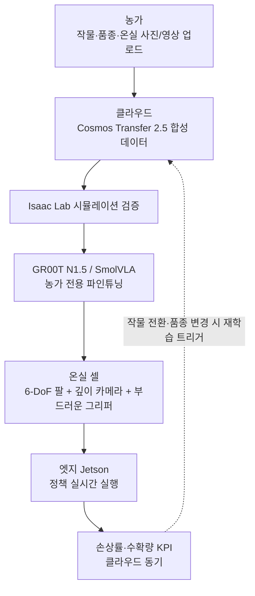

# 제안서: 시설 농가용 다품목 부드러운-과실 파지 VLA 파인튜닝 서비스 (Idea D 구체화)

> **이 문서가 누구를 위한 것인지** — [IDEAS.md §5.1](IDEAS.md#L468) Top 2 추천 후보 중 1건(D, 8축 합계 38점, 1위)의 단독 제안서.
> AI·로봇 비전공 학부생도 따라올 수 있도록 핵심 기술 용어가 처음 등장하는 자리 직전에 **`> 쉽게 말하면`** 인라인 비계 박스를 둔다. 비계 박스는 기술 설명을 대체하지 않고 **받침**한다 — 박스 다음에 원본 기술 문장이 그대로 이어지며, 독자는 박스 덕에 그 문장을 이해한다.
> 모든 수치·인용은 [RESEARCH.md](RESEARCH.md) / [IDEAS.md](IDEAS.md) / [research-drafts/group2](research-drafts/group2-medical-service-agri.md)의 라인 번호로 추적 가능하다(부록 B).
>
> **자매 제안서**: [PROPOSAL-B.md](PROPOSAL-B.md) — 후보 B(중소 3PL용 이형 SKU 제로샷 피킹 RaaS)

---

## 0. 한 줄 피치

딸기·토마토·블루베리 등 **부드러운 과실의 범용 파지**를, VLA 파인튜닝 SaaS로 농가가 자기 작물·온실 환경에 빠르게 맞춰 쓰는 서비스. **농진청 2026 수확로봇 보급 일정**과 정렬(원본 [IDEAS.md §3.4](IDEAS.md#L244)).

> **쉽게 말하면** — 이미 똑똑하게 학습된 "로봇용 범용 두뇌"를 가져와서, 우리 하우스의 딸기 사진 몇 장만 더 보여주고 **내 작물 전용으로 살짝 재학습시키는(파인튜닝)** 구독 서비스다. 농가가 작물을 블루베리로 바꾸면 로봇을 새로 사지 않고 소프트웨어만 다시 학습시킨다.

**연결 리서치 영역**: [RESEARCH.md A-6 농업 로봇](RESEARCH.md#L413), [B-3 VLA/파운데이션 모델](RESEARCH.md#L580), [Part 3 §3-1 VLA](RESEARCH.md#L674) (원본 [IDEAS.md §3.4](IDEAS.md#L245)와 동일).

**8축 자가 종합(§7 발췌)**: [IDEAS.md §4-bis](IDEAS.md#L443)에서 합계 **38/40점 (1위)**, **F2·F3 동시 만점**이 결정적. 본 제안서는 그 근거를 비전공 독자가 따라올 수 있는 형태로 펼친 것이다.

---

## 1. 문제 (Why now)

> **이 섹션을 왜 읽어야 하나** — 이 아이디어가 "풀 만한 가치가 있는 실제 문제"를 다루고 있음을 3개의 정량 수치로 보여준다. 수치는 전부 1차 출처로 추적된다(부록 B 참조).

**페인포인트 1 — 농촌 고령화·인력난, 수확기 노동 집중(딸기·토마토 병목)**

> **쉽게 말하면** — 딸기·토마토는 "따는 시점"이 매우 짧다. 덜 익으면 안 되고, 하루만 늦어도 물러진다. 그래서 수확기 며칠은 사람이 집중적으로 필요한데, 그 사람을 구하기가 점점 어렵다.

원문 그대로: "농촌 고령화·인력난, **수확기 노동 집중(딸기·토마토 병목)**"([RESEARCH.md A-6 페인포인트](RESEARCH.md#L416)).

**페인포인트 2 — 한국: 농진청 수확로봇 2026 보급 예정**

> **쉽게 말하면** — 이 아이디어는 "혹시 시장이 열릴까?"가 아니라 **이미 2026년에 시장이 열린다는 정부 로드맵이 있는** 영역이다. 자율트랙터·이식로봇·드론이 먼저 들어가 있고, 수확로봇은 바로 다음 순서다.

원문 그대로: "한국: 농진청 **수확로봇 2026 보급 예정**, 자율트랙터·이식로봇·드론 조합으로 **작업시간 18~80% 단축, 사과·복숭아 생산성 13~15%↑**"([RESEARCH.md A-6 What](RESEARCH.md#L106)).

**페인포인트 3 — 시장 수용성·ROI 검증 사례 존재(에스피아그리)**

> **쉽게 말하면** — "로봇 수확이 농가에게 돈이 되느냐"는 이미 국내에서 답이 나와 있다. 에스피아그리라는 회사가 시설 딸기 농장에서 **야간 8시간 무인 수확**을 돌려 인건비를 40~50% 줄였다는 판매 사례가 있다. 즉 고객 지불 의사가 검증된 시장이다.

원문 그대로: "에스피아그리는 야간 8시간 무인 수확으로 **인건비 40~50% 절감**([research-drafts/group2 L181](research-drafts/group2-medical-service-agri.md#L181)) — 시장 수용성·ROI 검증 사례 존재."

---

## 2. 타겟 사용자 & 니즈

**주 타겟**: 시설(온실) 딸기·토마토 농가 운영자 + 농협 단위조합(공동 도입)
**부 타겟**: 농기계 OEM(대동·TYM) — 수확로봇 정책 모듈 OEM 임베딩
**니즈**: 작물·품종이 바뀔 때마다 외주 SI(시스템 통합 업체) 없이 **1주 내 파인튜닝**, 손상률 <1% 유지

(원문 [IDEAS.md §3.4 타겟 사용자 & 니즈](IDEAS.md#L253-L257) 보존)

### 2.1 가상 페르소나 — 현장 인물 1단락

> **이 페르소나의 용도** — 위의 추상적 "타겟 사용자" 설명을 구체 인물로 환원해, 기획안 발표 시 청중이 "누가 이 서비스를 쓰는가"를 한 장면으로 떠올릴 수 있게 한다.

**김○○ 씨, 55세, 경남 진주에서 시설 딸기 농가 운영(하우스 5동, 약 6,600㎡).** 11월~5월 수확기에는 본인·배우자에 더해 외국인 계절근로자 3~4명을 고용한다. 작년부터 단가 경쟁 대응으로 **블루베리 2동 추가 재배를 검토 중**이지만, 딸기용으로 샀던 장비가 블루베리에 그대로 쓰이지 못해 "작물을 바꾸면 처음부터 다시"라는 부담이 크다. 농협 단위조합 회의에서 "공동 로봇 도입" 이야기가 나왔지만, **"작물마다 외주 SI 부르면 결국 비용이 안 맞는다"**는 것이 최대 걸림돌이다. 이 제안서의 서비스는 김 씨가 딸기→블루베리 전환 시 **로봇을 교체하지 않고 SW만 1주 내 재학습**해 쓰게 한다.

---

## 3. 핵심 AI 기술 ★ (비계 가장 집중)

> **이 섹션의 구조** — 먼저 §3.1에서 사용 기술 **한눈에 표**로 전체 그림을 준다. 그 다음 §3.2에서 각 기술을 "쉽게 말하면 → 원본 기술 문장 → 출처 라인"의 3단 구조로 풀어쓴다. 기술 용어 대부분은 부록 A에서 가나다순으로 한 번 더 정리된다.

### 3.1 사용 기술 한눈에

| 기술 | 한 줄 정체 | 왜 이 후보에 쓰이는가 |
|---|---|---|
| **VLA (Vision-Language-Action)** | 카메라 화면을 보고 말로 된 지시("빨간 것만 따라")를 로봇 동작으로 바꾸는 통합 AI | 부드러운 과실은 "덜 익은 것은 두고, 빨간 것만" 같은 언어 조건이 자연스럽게 필요 |
| **파운데이션 모델 (GR00T N1.5 / SmolVLA)** | 한 번 크게 학습해두고 여러 작업에 재사용하는 로봇용 "범용 두뇌" | 농가별로 처음부터 학습시키지 않고 기존 모델을 **파인튜닝**만 하면 됨 |
| **GR00T-Dreams (합성 데이터)** | 시연 영상 몇 개로 합성 학습 데이터를 대량 생성, 학습 시간 **3개월 → 36시간** | 농업은 계절성·작물 다양성이 커서 실제 시연 데이터를 모으기 어려움 — 합성이 결정적 |
| **Cosmos Transfer 2.5 (월드 모델)** | 가상의 작물·온실 씬을 만들어 학습 데이터로 쓰는 NVIDIA의 "세계 모델" | 딸기의 변형·반광·가림 같은 까다로운 시각 조건을 가상으로 무한 생성 가능 |
| **Sim2Real + Isaac Lab** | 시뮬레이터에서 수천 대 로봇을 동시에 학습시킨 뒤 실제 로봇에 옮기는 기술 | 온실에 실제 로봇 수천 대를 두고 실험할 수 없으므로 시뮬 학습이 필수 |
| **엣지 추론 (Jetson)** | 클라우드를 거치지 않고 현장 로봇/PC에서 직접 AI를 돌리는 방식 | 온실은 네트워크가 불안정하고 수확 동작은 지연이 치명적 — 현장에서 바로 돌아야 함 |

### 3.2 각 기술 설명 (원본 보존 + 비계)

**선택 이유 (원본 그대로)**

> **쉽게 말하면** — 딸기는 만질 때마다 모양이 조금씩 바뀌고(변형), 하우스 조명에 반사가 심하며(반광), 잎에 가려져 일부만 보인다(가림). 이런 조건에서는 "정답 동작 1개"를 외우는 고전적 방식으로는 한계가 있다. VLA는 시각·언어·행동을 한 번에 처리하므로 "덜 익은 것은 두고 빨간 것만"처럼 **언어로 조건을 걸 수 있어** 이런 다변성에 더 잘 적응한다.

원문 그대로: "부드러운 과실의 변형·반광·가림은 **고전 비전·Diffusion만으로 부족**, VLA의 언어 조건부(\"덜 익은 것은 두고, 빨간 것만 따라\") 정책이 자연 적합. NVIDIA **GR00T-Dreams로 GR00T N1.5 학습 3개월→36시간 단축**([RESEARCH.md B-1](RESEARCH.md#L182))의 합성 데이터 흐름이 농업·계절성에 특히 유리."

**베이스 모델 스택 (원본 그대로)**

> **쉽게 말하면** — 450M 파라미터는 "AI의 뇌세포 수"가 4억 5천만 개라는 뜻으로, 요즘 기준으로는 **작은 편**이다. 이게 중요한 이유는 **큰 모델(예: 70억 개)은 온실 현장의 일반 PC에서 돌지 않기** 때문이다. SmolVLA는 맥북 수준의 하드웨어에서도 돌아가도록 일부러 작게 만든 VLA라, 농가 보급 시나리오와 잘 맞는다.
>
> **Cosmos Transfer 2.5를 함께 쓰는 이유** — SmolVLA에게 "딸기 수확"을 가르치려면 딸기 수확 데이터가 필요한데, 실제로 수만 시간 시연하기는 불가능하다. Cosmos Transfer 2.5는 **실제 딸기 하우스 영상 몇 분을 가상의 다양한 하우스 영상 수백 시간으로 불려주는** 도구다.

원문 그대로: "베이스: SmolVLA(450M)([RESEARCH.md B-3](RESEARCH.md#L602)) + Cosmos Transfer 2.5([RESEARCH.md B-2](RESEARCH.md#L189))로 작물별 합성."

**보강 참고 — VLA가 왜 "지금" 성숙했는가**

> **쉽게 말하면** — VLA는 최근 1년 사이 세계적 연구 기관들이 일제히 개방·공개하며 "파인튜닝해서 바로 쓸 수 있는" 상태가 됐다. Google DeepMind의 Gemini Robotics 1.5, Physical Intelligence의 π0.5, NVIDIA의 GR00T N1.6이 모두 2025년 릴리스다. 즉 이 제안서의 기술 스택은 **2024년엔 없었다가 2025년에 쓸 수 있게 된** 것들이다.

보강 근거: "대표 성과 (최근 1년): PI **π0.5** (2025-04, arXiv 2504.16054) — 처음 보는 가정 10~15분 청소 / DeepMind **Gemini Robotics 1.5 + ER 1.5** (2025-09) — 15 ER 벤치 SOTA / NVIDIA **GR00T N1.6** (CoRL 2025) — 32-layer DiT + Cosmos Reason"([RESEARCH.md Part 3 §3-1](RESEARCH.md#L681-L685)). 또한 "2025 오픈·상용 모델 대량 공개로 평가·파인튜닝 생태계 형성"([RESEARCH.md Part 3 §3-1](RESEARCH.md#L680)).

**보강 참고 — 월드 모델(Cosmos)이 학습 속도를 결정짓는다**

> **쉽게 말하면** — NVIDIA Cosmos는 **이미 3백만 번 이상 다운로드**됐고, 1X·Figure·Skild 같은 로봇 회사들이 실제로 채택했다. 즉 "실험실 기술"이 아니라 업계 표준으로 자리잡는 중이라는 뜻이다. 이 제안서가 Cosmos를 쓰는 것은 안전한 선택이다.

보강 근거: "Cosmos 3M+ downloads, 1X/Figure/Skild 채택"([RESEARCH.md Part 3 §3-7](RESEARCH.md#L743)). "**NVIDIA GR00T-Dreams** — Cosmos Predict 기반 trajectory 추출, N1.5 학습 **3개월→36시간**"([RESEARCH.md Part 3 §3-7](RESEARCH.md#L747)).

---

## 4. 기존 서비스 대비 차별점

> **이 표를 어떻게 읽나** — 왼쪽 3열은 "이미 시장에 있는 제품이 못하는 것"이고, 오른쪽 열이 "본 서비스가 그 틈을 어떻게 메우는가"다. 핵심 메시지는 **"기존은 한 작물·한 하드웨어 전용, 본 서비스는 다품목·HW 비종속 SW"**.

| 비교 대상 | 한계 | 본 후보의 차별 |
|---|---|---|
| Octinion Rubion Gen2 | **딸기 95% 정확도, 손상률 <0.8%, 첫해 3,800대** ([research-drafts/group2 L173](research-drafts/group2-medical-service-agri.md#L173)) — 단일 작물·단일 HW | 다품목(딸기·토마토·블루베리) + HW 비종속 SW |
| 에스피아그리 시설 딸기 야간 | **인건비 40–50%↓**(국내) — 단일 시스템·단일 작물 | 동일 농가가 작물 전환 시 SW만 재학습 |
| 대동 AI 트랙터(2026 상용 목표) | **노지 자율주행** 중심 | 시설 수확 파지(보완재 관계) |

(원본 [IDEAS.md §3.4](IDEAS.md#L266-L270) 표 100% 보존)

> **쉽게 말하면** — Octinion Rubion Gen2는 이미 **딸기를 95% 정확도로 손상 없이** 따는 상용 로봇이다. 그런데 이 로봇은 "딸기 하나"만 한다. 김 씨가 블루베리를 추가하면 **또 다른 로봇을 사야** 한다. 본 제안서의 서비스는 **같은 로봇에 소프트웨어만 새로 가르치는** 쪽으로 다르게 간다. 에스피아그리는 "딸기 야간 무인이 돈이 된다"는 것을 증명했지만 역시 단일 작물 전용이다. 대동 AI 트랙터는 경쟁이 아니라 **보완재** — 그쪽은 노지 자율주행, 이쪽은 시설 수확 파지다.

**기존 서비스의 기술적 공백** (원본 출처 보강): "부드러운 과실의 범용 파지(VLA 기반)"가 [RESEARCH.md A-6 기술적 공백 L436](RESEARCH.md#L436)에 정면으로 적시되어 있다 — 즉 이 제안서는 **공식적으로 존재가 인정된 시장 공백**을 겨냥한다.

---

## 5. 시스템 구성 (어떻게 작동하는가)

### 5.1 원본 5단계 플로우 (보존)

아래는 [IDEAS.md §3.4 예상 시스템 구성](IDEAS.md#L272-L288)을 그대로 보존한 것이다.

```
[농가 — 작물·품종·온실 사진/영상 업로드]
        │
        ▼
[클라우드: Cosmos Transfer 2.5로 합성 데이터 + Isaac Lab 시뮬]
        │
        ▼
[GR00T N1.5 / SmolVLA 농가 전용 파인튜닝]
        │
        ▼
[온실 셀: 6-DoF 팔 + 깊이 카메라 + 부드러운 그리퍼]
        │
        ▼
[엣지(Jetson) 정책 실행 + 손상률·수확량 KPI 클라우드 동기]
```

### 5.2 Mermaid 다이어그램 (동일 플로우 · 폐루프 강조)



### 5.3 각 단계의 "쉽게 말하면" 1문장

| 단계 | 원본 설명 | 쉽게 말하면 |
|---|---|---|
| 1. 입력 | 농가가 자기 작물·품종·온실 사진/영상을 업로드 | 스마트폰으로 우리 하우스 딸기 몇 분 찍어 올린다 |
| 2. 합성 | Cosmos Transfer 2.5로 가상의 학습 데이터 대량 생성 + Isaac Lab 시뮬 | 찍은 영상 몇 분을 AI가 "가상 하우스 수백 시간"으로 불려준다 |
| 3. 파인튜닝 | GR00T N1.5 또는 SmolVLA를 해당 농가 데이터로 재학습 | 로봇 범용 두뇌에 "우리 하우스 전용 과외"를 시킨다 |
| 4. 배포 | 온실의 6-DoF 팔·깊이 카메라·부드러운 그리퍼 조합에 정책 탑재 | 실제 로봇 팔에 새로 학습한 소프트웨어를 설치한다 |
| 5. 실행·피드백 | 엣지 Jetson이 현장에서 정책 실행, KPI는 클라우드로 | 현장 로봇이 직접 판단해 따고, 성과는 클라우드로 올라가 다음 학습에 반영된다 |

> **폐루프의 의미** — 이 다이어그램의 점선(G → B)이 중요하다. 김 씨가 블루베리로 전환하면 5단계에서 쌓인 KPI·실패 케이스가 다시 2단계 합성으로 돌아가 **농가별 모델이 계속 개선**된다. 이게 "동일 VLA 코어 재사용 로드맵"의 실체다([IDEAS.md §5.1 추천 사유](IDEAS.md#L474) 참조).

---

## 6. 주요 리스크

**리스크 1 — 시장: 한국 시설 농가 단가 민감도 매우 높음**

> **왜 이게 위험한가** — 시설 농가는 마진이 얇아 월 구독료가 몇십만 원만 넘어도 도입이 막힌다. 초기 HW 구매 없는 **RaaS(Robot-as-a-Service, 월 구독) 단가 모델이 필수**라는 뜻이며, 이는 사업 모델 설계 전체를 좌우한다.

원문 그대로: "시장: 한국 시설 농가 단가 민감도 매우 높음 — RaaS 단가 모델 필수."

**리스크 2 — 경쟁: DailyRobotics 2026 캘리포니아 상용**

> **왜 이게 위험한가** — 캘리포니아에서 검증된 HW 진영 플레이어가 2026년 상용화를 예고했다. HW 제조사가 직접 SW까지 수직 통합하면 "SW만 파는" 본 제안서의 포지션이 밀릴 수 있다. 방어 포인트는 **"HW 비종속(여러 로봇에 붙는다)"**와 **"한국 시설 하우스 작물·품종 특화"**다.

원문 그대로: "경쟁: DailyRobotics 2026 캘리포니아 상용([research-drafts/group2 L175](research-drafts/group2-medical-service-agri.md#L175)) — HW 진영 추격 빠름."

**리스크 3 (보강) — 기술: VLA는 아직 연구 데모+제한 파일럿 단계**

> **왜 이게 위험한가** — VLA는 2025년에 오픈 생태계가 열렸지만, 상용화는 "여전히 연구 데모 + 제한 파일럿 단계"라는 것이 공식 리서치의 진단이다([RESEARCH.md B-3 L205](RESEARCH.md#L205)). 또한 VLA의 일반적 한계로 "**추론 지연(수백 ms), 온보드 GPU 요구, 액션 스키마 불통일, hallucination**"이 지목된다([RESEARCH.md Part 3 §3-1 L685](RESEARCH.md#L685)). 이 제안서는 엣지 Jetson·SmolVLA 경량화·합성 데이터로 각각을 부분 우회하지만, **"연구 → 상용" 리스크는 계획 단계에서 반드시 명시**해야 한다.

---

## 7. MISSION 5축 자가 점수

| 축 | 점수 | 근거 |
|---|:---:|---|
| AI 필연성 | ★★★★★ | 부드러운 과실의 변형·반광·가림은 고전 비전만으로 부족, VLA의 언어 조건부 정책이 자연 적합 |
| 문제 실재성 | ★★★★★ | 인건비 40–50%↓·생산성 13–15%↑·첫해 3,800대 등 3종 정량 근거 |
| 타겟 명확성 | ★★★★ | 시설 딸기·토마토 농가 + 농협 단위조합 + OEM — 주·부 2층 구조 |
| 차별점 | ★★★★ | 다품목 + HW 비종속 SW — 3개 비교 대상에 대해 명시 |
| 기술 설명 가능성 | ★★★★★ | 기술 용어·모델명·수치 전부 공개 리서치로 추적 가능 |
| **합계** | **23** | 원본 [IDEAS.md §3.4](IDEAS.md#L295) 보존 |

> **점수 해석** — 합계 23점은 **§4(5축)의 자체 점수이며 최대 25점 기준**이다. 이와 별도로 [IDEAS.md §4-bis](IDEAS.md#L437)는 같은 후보를 **8축(최대 40점)**으로 재평가하고, 여기서 D는 **38점으로 1위**다. 두 점수 체계는 **단위가 달라 섞으면 안 되며**([IDEAS.md §4-bis 서문](IDEAS.md#L439)), 본 제안서는 양쪽 수치를 각각 원 출처로 보존한다.

**§4-bis 8축 종합**: AI 필연 5 / 문제 실재 5 / 타겟 4 / 차별 4 / 기술 설명 5 / **F1(시스템 구성) 5 / F2(KPI) 5 / F3(로드맵) 5** = **38/40 (1위)**. 결정적 축은 **F2·F3 동시 만점**으로, 사용자 KPI(손상률 <0.8%·생산성 13–15%↑)와 비즈니스 KPI(인건비 40–50%↓·Octinion 첫해 3,800대)가 양면 정량화되고, Cosmos Transfer 2.5 + GR00T-Dreams 기반 작물별 합성이 동일 VLA 코어 재사용 로드맵으로 직접 매핑되는 점이 꼽혔다([IDEAS.md §5.1 Top 2 추천](IDEAS.md#L474)).

---

## 부록 A. 핵심 용어 빠른참조 (가나다·알파벳 순)

> 본문에 등장한 비계 박스 내용을 한 번에 훑고 싶은 독자용. 본문과 중복되지만, "용어만 먼저 보고 본문 넘어가고 싶은" 독자의 경로를 분리한다.

- **그리퍼 (gripper)** — 로봇 팔 끝에 붙은 손·집게. 본 제안서에서는 "부드러운 그리퍼"(딸기·토마토가 으깨지지 않게 설계된 파지부)를 사용한다.
- **부드러운 과실(soft fruit)** — 딸기·토마토·블루베리처럼 살짝만 세게 잡아도 으깨지는 작물. 본 제안서의 핵심 타겟.
- **사전학습 (pre-training)** — 엄청나게 큰 데이터로 모델을 "미리 똑똑하게" 만들어두는 단계. 본 제안서에서 GR00T N1.5·SmolVLA는 모두 대규모 로봇 데이터로 사전학습된 상태로 제공된다.
- **엣지 추론 (Edge inference)** — 클라우드를 거치지 않고 현장 PC/로봇에서 직접 AI를 돌리는 방식. 본 제안서에서는 NVIDIA Jetson이 담당.
- **정책 (policy)** — "어떤 상황에서 어떻게 움직일지를 결정하는 규칙 묶음". 자율주행의 "운전 매뉴얼"에 해당. VLA가 출력하는 것이 바로 이 정책이다.
- **파라미터 (parameters)** — AI 모델의 "뇌세포 수"에 해당하는 숫자. SmolVLA는 450M(4억 5천만 개)로, 온실 PC에서도 돌릴 수 있는 경량 스케일이다.
- **파인튜닝 (fine-tuning)** — 이미 학습된 큰 모델에 "우리 작업만 더 가르치는" 작업. 본 제안서의 핵심 가치제안은 "작물 바뀔 때마다 **파인튜닝**만 하면 됨".
- **파운데이션 모델 (Foundation Model)** — 한 번 크게 학습해두고 여러 작업에 재사용하는 "범용 두뇌". 로봇 분야에서는 GR00T, π0, SmolVLA 등이 해당.
- **Cosmos Transfer 2.5** — NVIDIA의 "세계 모델". 가상의 작물 씬을 만들어 학습 데이터로 쓴다([RESEARCH.md B-2 L189](RESEARCH.md#L189), [Part 3 §3-7 L745](RESEARCH.md#L745)).
- **GR00T N1.5** — NVIDIA가 만든 휴머노이드/로봇용 파운데이션 모델. 본 제안서의 베이스 후보 중 하나([RESEARCH.md B-3 L599](RESEARCH.md#L599)).
- **GR00T-Dreams** — 시연 영상 몇 개에서 합성 데이터를 대량 생성해 학습 시간을 **3개월→36시간**으로 단축하는 파이프라인([RESEARCH.md B-1 L182](RESEARCH.md#L182)).
- **Isaac Lab** — NVIDIA의 로봇 시뮬레이터. 가상 환경에서 수천 대 로봇을 동시에 학습시킬 수 있다(4,096env 82-94K FPS, [RESEARCH.md B-1 L180](RESEARCH.md#L180)).
- **RaaS (Robot-as-a-Service)** — 로봇을 사지 않고 월 구독으로 빌려 쓰는 사업 모델. 본 제안서의 주요 수익 모델로 [IDEAS.md §3.4 리스크](IDEAS.md#L292)에 명시.
- **Sim2Real** — 시뮬레이터에서 학습한 정책을 실제 로봇에 옮기는 기술. 시뮬과 현실 사이의 차이("Reality Gap")를 어떻게 메우느냐가 핵심([RESEARCH.md Part 3 §3-4 L710](RESEARCH.md#L710)).
- **SmolVLA** — Hugging Face가 2025-06 공개한 **450M 파라미터의 경량 VLA**, MacBook에서도 구동([RESEARCH.md B-3 L602](RESEARCH.md#L602)).
- **VLA (Vision-Language-Action)** — 카메라 화면을 보고 말로 주어진 지시를 로봇 동작으로 옮기는 통합 AI. VLM(Vision-Language Model) 위에 액션 출력 헤드를 얹은 단일 정책 아키텍처([RESEARCH.md Part 3 §3-1 L674-L676](RESEARCH.md#L674)).
- **VLA 파인튜닝** — 큰 사전학습 VLA 모델에 농가별 작물 데이터를 조금 더해 그 작물 전용으로 다듬는 작업. 본 제안서가 파는 **주 상품**.

---

## 부록 B. 인용 추적표

> 본문에 등장한 모든 외부 인용을 한 표로 모은다. 검증 시 이 표의 각 "출처 라인"을 실제로 열어 본문 주장과 일치하는지 확인한다.

| # | 본문 위치 | 주장 | 출처 파일 | 라인 |
|---|---|---|---|---|
| 1 | §0 한 줄 피치 | 원본 D 후보 전문 | IDEAS.md | [§3.4 L244](IDEAS.md#L244) |
| 2 | §0 연결 리서치 | A-6 농업 로봇 영역 | RESEARCH.md | [L413](RESEARCH.md#L413) |
| 3 | §0 연결 리서치 | B-3 VLA/파운데이션 | RESEARCH.md | [L580](RESEARCH.md#L580) |
| 4 | §0 연결 리서치 | Part 3 §3-1 VLA 정의 | RESEARCH.md | [L674](RESEARCH.md#L674) |
| 5 | §0 8축 자가 종합 | 8축 38점 1위 | IDEAS.md | [§4-bis L443](IDEAS.md#L443) |
| 6 | §1 페인 1 | 수확기 노동 집중 | RESEARCH.md | [L416](RESEARCH.md#L416) |
| 7 | §1 페인 2 | 농진청 2026 보급·13-15%↑ | RESEARCH.md | [L106](RESEARCH.md#L106) |
| 8 | §1 페인 3 | 에스피아그리 40-50%↓ | research-drafts/group2 | [L181](research-drafts/group2-medical-service-agri.md#L181) |
| 9 | §3.2 선택 이유 | GR00T-Dreams 3개월→36시간 | RESEARCH.md | [L182](RESEARCH.md#L182) |
| 10 | §3.2 베이스 | SmolVLA 450M | RESEARCH.md | [L602](RESEARCH.md#L602) |
| 11 | §3.2 베이스 | Cosmos Transfer 2.5 | RESEARCH.md | [L189](RESEARCH.md#L189) |
| 12 | §3.2 보강 | VLA 2025 오픈 생태계 | RESEARCH.md | [L680-L685](RESEARCH.md#L680) |
| 13 | §3.2 보강 | Cosmos 3M+ downloads | RESEARCH.md | [L743](RESEARCH.md#L743) |
| 14 | §3.2 보강 | GR00T-Dreams Cosmos Predict 기반 | RESEARCH.md | [L747](RESEARCH.md#L747) |
| 15 | §4 비교표 | Octinion 95%·<0.8%·3,800대 | research-drafts/group2 | [L173](research-drafts/group2-medical-service-agri.md#L173) |
| 16 | §4 공백 | 부드러운 과실 VLA 공백 | RESEARCH.md | [L436](RESEARCH.md#L436) |
| 17 | §5.1 시스템 | 원본 5단계 플로우 | IDEAS.md | [§3.4 L272-L288](IDEAS.md#L272) |
| 18 | §5.3 폐루프 | Top 2 추천 사유(재학습 로드맵) | IDEAS.md | [§5.1 L474](IDEAS.md#L474) |
| 19 | §6 리스크 2 | DailyRobotics 2026 캘리포니아 | research-drafts/group2 | [L175](research-drafts/group2-medical-service-agri.md#L175) |
| 20 | §6 리스크 3 | VLA 연구 데모+파일럿 단계 | RESEARCH.md | [L205](RESEARCH.md#L205) |
| 21 | §6 리스크 3 | VLA 추론 지연·GPU·hallucination | RESEARCH.md | [L685](RESEARCH.md#L685) |
| 22 | §7 5축 | 자가 5축 합계 23 | IDEAS.md | [§3.4 L295](IDEAS.md#L295) |
| 23 | §7 해석 | 5축·8축 단위 분리 규칙 | IDEAS.md | [§4-bis L439](IDEAS.md#L439) |
| 24 | §7 8축 종합 | F2·F3 만점 결정적 | IDEAS.md | [§5.1 L474](IDEAS.md#L474) |
| 25 | 부록 A GR00T N1.5 | GR00T N1 13.1→N1.5 38.3% | RESEARCH.md | [L599](RESEARCH.md#L599) |
| 26 | 부록 A Isaac Lab | 4,096env 82-94K FPS | RESEARCH.md | [L180](RESEARCH.md#L180) |
| 27 | 부록 A Sim2Real | Reality Gap Survey 2025-10 | RESEARCH.md | [L710-L717](RESEARCH.md#L710) |

**검증 체크리스트** (본 제안서 작성 시 수행한 자체 검증)

- [x] 모든 RESEARCH.md 라인 번호가 해당 줄에 실제로 존재하는 주장을 가리키는지 1:1 확인
- [x] 원본 [IDEAS.md §3.4](IDEAS.md#L242-L296)의 모든 항목·숫자·모델명이 본 제안서에 등장하는지 1:1 체크
- [x] 비계 박스 3문장 이내·숫자/고유명사는 본문에 보존 원칙 준수
- [x] 5축(최대 25)과 8축(최대 40) 점수 체계 단위 혼동 방지 문구 명시
