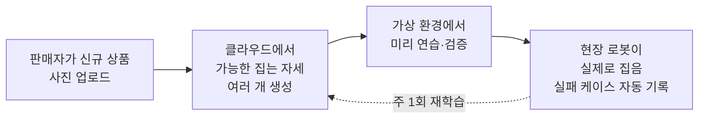
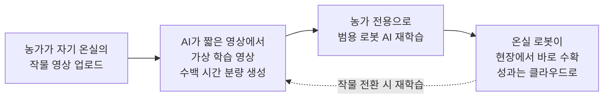

# 팀 회의용 — AI Robotics 아이디어 후보 2개 소개

> 이 문서는 팀 회의에 내가 가져갈 **AI Robotics 아이디어 후보 2개**를, 다른 팀원이 본인 아이디어와 **같은 기준으로 비교할 수 있도록** 짧게 정리한 자료다. 최종 1개 선정은 모든 팀원의 아이디어를 함께 본 뒤 팀이 결정한다. 각 후보의 수치 출처·모델명·리스크 상세는 [PROPOSAL-B.md](./PROPOSAL-B.md) / [PROPOSAL-D.md](./PROPOSAL-D.md) / [IDEAS.md](./IDEAS.md)에 따로 정리돼 있다.

---

## 1. 후보 B — 창고용 이형 상품 피킹 로봇 구독 서비스

### 1.1 한 줄 피치

네모난 박스는 잘 집지만 **모양이 제각각인 상품**(찌그러진 봉지·꽃다발·화장품 샘플 등)에서 자주 실패하는 기존 창고 로봇의 문제를 푸는 서비스다. **처음 보는 상품도 등록 없이 바로 집는** 로봇을 만들고, 이 로봇을 **월 구독으로 빌려 쓰는** 방식으로 중소 물류 대행업체에 공급한다.

### 1.2 풀려는 문제

- 대형 창고 자동화도 표준 박스에서는 정확하지만, **모양이 제각각인 상품에서는 성공률이 급락**한다 — 전체 피킹 정확도 **99.5% 이상**을 내는 시스템도 이형·변형·손상 상품에서는 급락한다는 업계 진단(TGW 2025 업계 보고서).
- 미국 물류업계 협회(MHI) 2025년 연례 설문에서 **45~52% 기업이 "사람 구하기가 매우 어렵다"**고 답했다. 국내도 블랙프라이데이·명절 성수기마다 같은 인력난이 반복된다.
- 대기업은 자체 로봇을 만들어 쓰지만(예: 쿠팡 물류 로봇 THiRAbot, CJ 휴머노이드 실증, 아마존 Sequoia 자체 구축), 중소 물류 대행업체는 **수억 원대 설비를 감당하지 못해** 선택지가 비어 있다 — "한국 중견·중소 물류 대행업체용 구독형 로봇 모델 확산 미흡"이 업계 리서치에서 공식 기술적 공백으로 지목된다.

### 1.3 누구를 위한 서비스인가

매출 100~1,000억 원 규모의 **중소 물류 대행업체 운영팀장**이 주 타겟. 인력난과 오배송 클레임은 대기업과 같지만, 대형 자동화 설비를 살 여력은 없다. "모레 입고되는 신규 상품 500종을 **오늘 등록 없이** 집어낼 수 있느냐"가 그가 묻는 질문이다.

### 1.4 어떻게 작동하나

신규 상품 사진을 올리면 AI가 가능한 파지 자세를 여러 개 떠올리고, 가상 환경에서 먼저 검증한 뒤 현장 로봇이 그 결과로 실제 파지를 수행한다. 실패한 경우는 자동으로 모아 주 1회 재학습해 **쓸수록 똑똑해지는** 구조다.

### 1.5 기존 대비 무엇이 다른가

현재 시장의 경쟁 제품은 두 갈래다. 하나는 **박스 위주**라 이형 상품에 약하다 — 보스턴 다이내믹스 Stretch는 **시간당 700 케이스**를 처리하지만 케이스박스 중심이라 이형 화물에 취약하다. 다른 하나는 사람 옆에서 **나르기만** 하고 집는 일은 사람이 한다(Locus Robotics의 창고 이동 로봇). 국내 직접 경쟁자로는 3D 비전+AI 피킹 영역의 **씨메스**가 가장 가깝다. 본 후보는 **집는 일 자체를 이형 상품에서도** 자동화하고, 중소 업체가 **사지 않고 빌려 쓸 수 있게** 단가 모델을 바꾼 점이 다르다.

### 1.6 왜 AI여야 하나

모양이 제각각인 상품의 집는 자세는 **사람이 규칙으로 다 적어줄 수 없다**. 같은 립스틱도 옆으로·위에서·뚜껑 쪽으로 집는 방법이 공존한다. 이런 "정답이 여러 개 있는" 상황은 **여러 후보를 동시에 떠올려 그중 안전한 걸 고르는** 최근 AI 방식이 자연스럽게 잘 맞는다.

### 1.7 기술 실현 가능성

이형 파지는 "범용 AI 하나"가 아니라 **3단 구성**으로 돌아간다.

1. **로봇 조작 전용 범용 AI의 공개** — 챗봇 같은 일반 AI가 아니라, 21개 기관이 공유한 **로봇 시연 100만 건 이상(Open X-Embodiment)** 위에서 사전학습된 **Physical Intelligence의 π0 / π0.5**(7개 플랫폼 68개 과제에서 기존 최고 성적 경신)가 **2025년 상업 이용 가능한 오픈 라이선스**로 공개돼, "집는 행위" 자체는 바닥부터 배울 필요가 없어졌다.
2. **이형에 구조적으로 맞는 학습 방식** — 립스틱을 옆/위/뚜껑으로 집는 식의 "정답이 여러 개" 상황에서 평균을 내지 않고 **여러 후보를 동시에 떠올려 그중 안전한 걸 고르는** 정책 학습(업계에서 Diffusion Policy 계열로 불림)을 그 위에 얹는다. 2025년 ICML에 발표된 개선판(Spherical Diffusion Policy)은 회전·이동 불변성을 수학적으로 강제해 **같은 데이터로도 일반화**를 더 잘한다.
3. **빠른 재학습 폐루프** — 실제 로봇을 움직이기 전에 **가상 환경(Isaac Lab)에서 수천 번 미리 돌려 검증**하고, 현장 투입 뒤 실패 케이스를 자동 기록해 **주 1회 재학습**하는 구조. 바닥부터 학습하지 않으므로 **새 상품군이 며칠~몇 주 단위로 흡수**된다. 원격 시연 데이터 단가도 **2024년 초 $340 → 2025년 4분기 $136(약 60% 하락)**으로 내려가 초기 6~12개월 셀러 데이터 수집 비용이 크게 낮아졌다.

단, **공개됐다는 것과 대규모 상업 배포가 검증됐다는 것은 다른 이야기**다 — 업계 리서치는 최신 로봇 AI 전반이 **여전히 "연구 데모 + 제한 파일럿 단계"**에 머문다고 진단하며, **추론 지연·현장 GPU 요구·드문 오동작** 같은 운영 한계도 공통으로 지적된다. 가상 검증·재학습 폐루프는 필수 전제다.

---

## 2. 후보 D — 시설 농가용 무른 과실 수확 로봇 맞춤 서비스

### 2.1 한 줄 피치

딸기·토마토·블루베리 같은 **무른 과실을 손상 없이 따는 로봇**에, 각 농가의 작물·온실 환경에 맞춰 **소프트웨어만 1주 안에 다시 학습**시키는 구독 서비스다. 작물을 바꿔도 로봇을 새로 사지 않고 **AI만 갈아 끼운다**.

### 2.2 풀려는 문제

- 딸기·토마토는 **따는 시점이 며칠로 짧아** 수확기에 인력이 집중적으로 필요한데, 농촌 고령화로 그 인력을 구하기가 점점 어려워진다 — **농촌진흥청** 및 업계 언론(굿모닝경제 등)이 "농촌 고령화·인력난, **수확기 노동 집중(딸기·토마토 병목)**"을 현장 페인포인트로 반복 지목해 왔다.
- 정부(농촌진흥청) 공식 로드맵상 **2026년 수확 로봇 보급**이 예정돼 있고, 먼저 들어간 자율 트랙터·이식 로봇·드론은 이미 **작업시간 18~80% 단축, 사과·복숭아 생산성 13~15% 향상**의 실측 성과를 내고 있다. "혹시 시장이 열릴까?"가 아니라 **열리는 날짜가 정해진** 영역이다.
- 국내 **에스피아그리**가 시설 딸기 농장에서 **야간 8시간 무인 수확으로 인건비를 40~50% 줄인** 판매 사례가 이미 나와 있어, 농가가 돈을 낼 의사는 확인돼 있다.
- **왜 하필 무른 과실인가**: 위 세 근거(**노동 병목·정부 로드맵·ROI 검증**)가 가장 심하게 겹치는 작물군이 바로 딸기·토마토·블루베리 같은 **무른 과실**이다 — 수확 시점이 짧은 동시에 **살짝만 세게 잡아도 상해서** 기존 자동화가 닿지 못했던 영역이라, 세 축이 **한 작물군에서 맞아떨어진다**.

### 2.3 누구를 위한 서비스인가

시설(온실) 딸기·토마토 농가 운영자와 **농협 단위조합**(공동 도입)이 주 타겟. 예컨대 하우스 5동 규모 딸기 농가가 다음 철에 블루베리를 추가할 때, **로봇을 새로 사지 않고 소프트웨어만 1주 안에 다시 학습**해서 그대로 쓰게 한다.

### 2.4 어떻게 작동하나

농가가 자기 온실 영상을 몇 분 찍어 올리면, AI가 이를 **수백 시간 분량의 가상 온실 학습 영상으로 생성**한 뒤, **이미 크게 학습된 범용 로봇 AI**를 그 농가 전용으로 다시 가르친다. 다음 철에 작물을 바꾸면 같은 흐름을 한 번 더 돌린다.

### 2.5 기존 대비 무엇이 다른가

현재 상용화된 수확 로봇은 **딸기 한 작물에 특화**돼 있다 — 대표 사례 **Octinion Rubion Gen2**는 딸기 수확에서 **정확도 95%, 손상률 0.8% 이하, 첫해 3,800대 판매** 실적을 냈지만 작물이 바뀌면 그대로 쓰지 못한다. 국내 **에스피아그리**도 "딸기 야간 수확이 돈이 된다"는 것을 증명했지만 역시 단일 작물·단일 시스템이다. 본 후보는 **같은 로봇에 소프트웨어만 갈아 끼우는** 쪽으로 다르게 간다. 국내 농기계 업체(**대동 AI 트랙터 2026년 상용 목표** 등)가 노지에서 하는 자율주행과는 경쟁이 아니라 **서로 보완**하는 관계다(그쪽은 노지 주행, 이쪽은 시설 수확).

### 2.6 왜 AI여야 하나

딸기는 **만질 때마다 조금씩 모양이 바뀌고**, 하우스 조명에 **반사가 심하며**, **잎에 가려져 일부만 보인다**. 이런 까다로운 조건은 규칙 기반으로 풀기 어렵다. 최근 AI는 **카메라로 보고 사람 말("덜 익은 건 두고 빨간 것만")을 알아듣고 움직이는** 통합 구조가 가능해져, 작물이 바뀌어도 **말로 가르쳐서** 같은 로봇을 계속 쓰게 할 수 있다.

### 2.7 기술 실현 가능성

2024년까지 **대부분 연구실 내부에 머물며 외부에서 쓸 수 없었던** **"보고 말 알아듣고 움직이는 로봇 AI"**와 **로봇 학습용 세계 모델**이 2025년 들어 **상업 이용 가능한 오픈 라이선스로 가중치·코드가** 잇달아 공개됐다 — **NVIDIA GR00T N1.5**, **허깅페이스 SmolVLA**(맥북 수준 기기에서도 구동되는 경량 모델), **Physical Intelligence π0.5**(처음 보는 가정에서 10~15분 청소 데모), 그리고 학습 영상 합성을 담당하는 **NVIDIA Cosmos**가 모두 여기에 해당한다. 여기서 '공개'는 논문·데모가 아니라 **제3자가 내려받아 자기 환경에 재학습해 쓸 수 있는 상태**를 뜻한다. Cosmos는 이미 **300만 회 이상 다운로드되고 1X·Figure 등 로봇 기업이 제품에 실제 채택**해 상용 투입이 검증됐다. 이 Cosmos + GR00T-Dreams 파이프라인으로 **농가 영상 몇 분에서 가상 영상 수백 시간 분량을 생성**, **학습 시간을 3개월 → 36시간으로 단축**한 사례가 보고됐다. 단, **공개됐다는 것과 대규모 상업 배포가 검증됐다는 것은 다른 이야기**다 — 업계 리서치는 최신 로봇 AI 전반이 **여전히 "연구 데모 + 제한 파일럿 단계"**에 머문다고 진단하므로, 현장 상용화 리스크는 계획에 반드시 반영해야 한다.

---

## 3. 요약 비교

| 축 | 후보 B — 창고 로봇 | 후보 D — 과실 수확 로봇 |
|---|---|---|
| 한 줄 정체 | 모양이 제각각인 상품도 바로 집는 **창고용 로봇을 월 구독으로 빌려 쓰는** 서비스 | 딸기·토마토 같은 **무른 과실을 따는 로봇**에 농가별 소프트웨어를 입혀 주는 서비스 |
| 핵심 문제 | 박스는 잘 집는 창고 로봇이 **찌그러진 봉지·꽃다발·화장품 샘플**에서는 자주 실패함 | 딸기·토마토는 **따는 시점이 며칠**로 짧은데 그때 쓸 사람이 구해지지 않음 |
| 타겟 | 매출 100~1,000억 규모의 **중소 물류 대행업체** 운영팀장 | 시설(온실) 딸기·토마토 농가 + 농협 단위조합 |
| 핵심 AI | 한 가지 파지 자세를 외우는 대신 **여러 자세를 동시에 떠올린 뒤 안전한 걸 고르는** 로봇용 AI | 카메라로 보고 **사람 말("빨간 것만 따라")을 알아듣고 움직이는** 로봇용 AI |
| 사업 모델 | 로봇 1셀 단위 **월 구독** (사지 않고 빌려 씀) | 농가별 **소프트웨어 재학습 + 월 구독** (로봇 교체 없이 AI만 갈아 끼움) |
| 가장 큰 리스크 | 국내외 경쟁자가 같은 공백을 **동시에 조준** 중 — 포지션 굳히기 속도전 | 농가 단가 민감도가 높아 **구독료가 조금만 높아도** 도입이 막힘 |

---

## 4. 두 후보의 강점 요약 (다른 팀원 아이디어와 비교할 때 참고할 축)

- **시장이 열리는 시점** — B는 "한국 중견·중소 물류 대행업체용 구독형 로봇 모델 확산 미흡"이 업계 리서치에서 **공식 기술적 공백**으로 적시돼 있다는 점이 강점. D는 **농진청 2026년 수확 로봇 보급 로드맵** + 국내 **에스피아그리 인건비 40~50% 절감** 상용 사례가 이미 있어 시의성이 강점.
- **데이터 확보 난이도** — B는 판매자가 올려주는 **상품 사진을 재사용**. D는 농가 영상 몇 분을 **가상 데이터로 불려 쓰는** 방식. 양쪽 모두 "처음부터 전량 촬영"하지 않아도 된다.
- **발표 청중 직관성** — B는 "창고 로봇이 봉지·꽃다발을 집는 장면", D는 "딸기 따는 로봇이 덜 익은 건 두고 빨간 것만 따는 장면". 둘 다 AI 배경이 없어도 1분 안에 떠올릴 수 있는 장면이다.
- **향후 확장성** — B는 새 상품이 들어올수록 **취급 품목이 자동으로 넓어짐**. D는 작물을 바꿀 때 로봇 교체 없이 **소프트웨어만 재학습**해 다음 작물로 옮겨 감. 둘 다 "같은 뼈대를 다른 영역으로" 넓히는 경로가 있다.
- **경쟁 강도** — B는 국내 **씨메스**(3D 비전+AI 피킹) / 해외 **Inbolt**(온-암 AI 비전) / 휴머노이드 진영(CJ의 Physical AI 실증)이 **여럿 동시에 같은 공백을 조준** 중이라 속도 경쟁 성격. D는 **Octinion Rubion Gen2**(딸기 95%·첫해 3,800대) 같은 단일 작물 전용 경쟁자가 이미 상용화에 도달했고, 하드웨어 진영의 **DailyRobotics가 2026년 캘리포니아 상용**을 예고해 **다품목 포지션 차별화**가 필요.
- **기술 실현 가능성(지금 돌릴 수 있나)** — B·D 모두 2025년 들어 상업 이용 가능하게 공개된 **오픈 로봇 AI**(Physical Intelligence π0·허깅페이스 SmolVLA·NVIDIA GR00T N1.5 등)와 **합성 데이터 파이프라인**(NVIDIA Cosmos·GR00T-Dreams) 덕에 **2024년엔 불가능했던 학습 구조가 올해 가능해졌다**. 공통 리스크는 업계 리서치가 최신 로봇 AI를 **"연구 데모 + 제한 파일럿 단계"**로 진단한다는 점 — 현장 투입 시 가상 검증·실패 폐루프가 필수.
- **4주 안에 기획안 완성 가능성** — 두 후보 모두 [PROPOSAL-B.md](./PROPOSAL-B.md) / [PROPOSAL-D.md](./PROPOSAL-D.md)가 이미 작성돼 있어, 팀이 선택만 하면 발표 준비 단계로 바로 이어진다.

---

## 5. 출처 · 더 깊이 보고 싶다면

본문에 인용한 수치·사례의 1차 출처는 아래 문서에 라인 단위로 추적돼 있다.

- **후보 B 근거** — TGW 2025 피킹 정확도 보고서 / MHI 2025 연례 설문(45~52%) / 쿠팡·CJ·아마존 자체 구축 사례 / "한국 중소 물류업체용 구독형 로봇 공백" 공식 지적 / 경쟁자(씨메스·Inbolt·휴머노이드 진영) → 전량 [PROPOSAL-B.md](./PROPOSAL-B.md) 부록 B 인용 추적표에 원문 라인 단위 보존
- **후보 D 근거** — 농진청 2026 수확 로봇 보급 로드맵(작업시간 18~80%↓·생산성 13~15%↑) / 에스피아그리 야간 무인 수확(인건비 40~50%↓) / Octinion Rubion Gen2(95%·0.8%·3,800대) / DailyRobotics 2026 캘리포니아 상용 / 대동 AI 트랙터 2026 상용 → 전량 [PROPOSAL-D.md](./PROPOSAL-D.md) 부록 B 인용 추적표에 보존
- **선정 과정** — [IDEAS.md](./IDEAS.md) §3.2·§3.4·§4-bis·§5.1 (6개 후보 비교와 Top 2 추천 근거)

<!--
참고 기술 스택 (호기심용 — 발표 본문에는 사용하지 않음):
  후보 B : 비전 파운데이션 모델 + Diffusion Policy 계열 + π0/openpi + Isaac Lab + Open X-Embodiment
  후보 D : SmolVLA(450M) + GR00T N1.5 + Cosmos Transfer 2.5 + GR00T-Dreams + Isaac Lab + Jetson
-->
